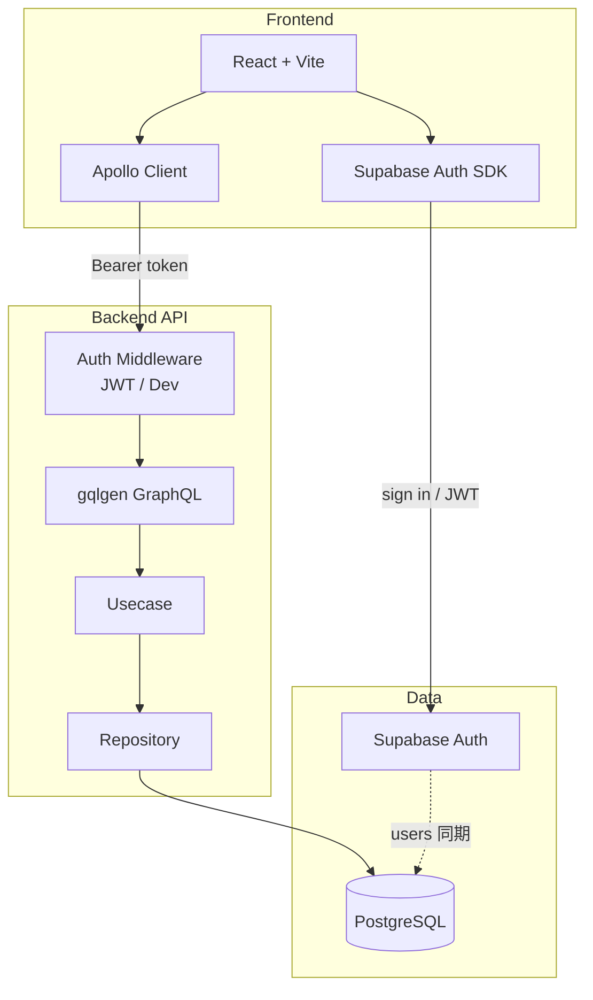
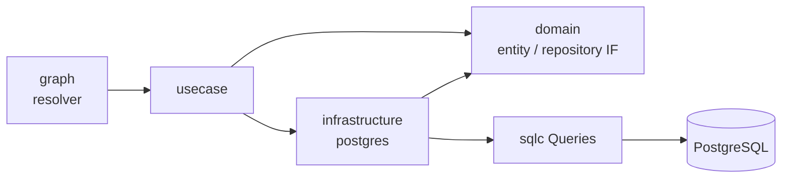

# Pathway

**日々の行動を積み上げ、目標への道筋を見える化するパーソナル成長アプリ**

> Todos（タスク）・Daily Log（継続の記録）・Roadmap（マインドマップ型ロードマップ）を一つのサービスにまとめ、  
> 「今日やること」から「長期の目標構造」までを一貫して扱えるようにしています。

---

## 💡 開発アプローチ：AIプロトタイプとスクラッチ開発の融合

本プロジェクトでは、「AIによる高速な要件定義」と「エンジニアによる堅牢なインフラ・アーキテクチャ構築」を切り分けるモダンなアプローチを採用しています。

### 1. プロトタイプフェーズ（AIエージェントによる自動生成）

[](https://github.com/user-attachments/assets/0745dadd-9692-43d4-8169-a974442538ae)


**プロトタイプを作った理由：**
「どういう機能が欲しいか」というアイデアをAIエージェントに指示し、即座に動くモックアップを生成することで、開発前の要件定義とUI/UXの検証を爆速で行うためです。
しかし、AIが生成するコードは局所最適になりがちでブラックボックス化しやすく、高トラフィックを見据えたDB設計やシステム全体の保守性（非機能要件）の担保には適していません。

### 2. プロダクションフェーズ
<!-- 👇 ここに黒画面（自作の本番環境）のGIFや動画リンクを配置してください -->
[](https://github.com/user-attachments/assets/e76af71f-1c3d-4ff4-afd7-f0379394cd59)

**ゼロから自作し直した理由：**
AIが生成したプロトタイプをあくまで「設計の指針」とし、本番運用に耐えうる堅牢なシステムを自身のエンジニアリング力で構築するためです。
Go / Cloud Run / Supabase を用いたバックエンドの構築から、GitHub ActionsによるCI/CDパイプライン、AIコードレビュー機構の導入まで、システム全体の安定稼働と「全体最適」を重視してゼロから実装しています。

---

## なぜ作ったか

成長や学習は、タスク消化だけでは続きにくく、一方で大きな目標だけだと日々の行動に落ちません。  
Pathway は次の3層をつなぐことを意図しています。

| レイヤー | 役割 |
|----------|------|
| **Todos** | 今日の具体アクションを管理する |
| **Daily Log** | 日単位の完了状況をカレンダーで振り返る |
| **Roadmap** | 目標をツリー構造で設計し、親子関係を編集する |

個人開発ながら、**認証・API 設計・クリーンな層分割・型安全なコード生成**まで、実務に近い構成で実装しています。

---

## 主な機能

### Todos
- タスクの作成・編集・削除
- ステータス管理（未着手 / 着手 / 完了）

### Daily Log
- 日次の完了スナップショットをカレンダー表示
- 過去分の catch-up（集計の補完）

### Roadmap（マインドマップ UI）
- ユーザーごとに複数ロードマップを作成
- React Flow によるツリー表示（親子エッジ、自動レイアウト）
- Enter で子ノード作成 / Delete で子孫ごと削除
- ダブルクリックでタイトル編集
- フォーカスノードのハイライト、Tab で兄弟間移動

---

## 技術スタック

| 領域 | 技術 |
|------|------|
| Frontend | React 19, TypeScript, Vite, Apollo Client, Tailwind CSS, shadcn/ui, React Flow |
| Backend | Go, gqlgen (GraphQL), sqlc, pgx |
| Auth / DB | Supabase Auth (JWT), PostgreSQL (Supabase) |
| Infra | Docker Compose, Cloud Run 想定の構成 |

---

## システムアーキテクチャ



### Backend の層構造（Clean Architecture 風）



リクエストは次の流れで処理されます。

1. CORS + Auth ミドルウェアが JWT（または dev ユーザー）から `userID` を context に載せる  
2. gqlgen が GraphQL をパースし、resolver が usecase を呼ぶ  
3. usecase がドメインルール（所有権・親子整合など）を担保する  
4. repository / sqlc が PostgreSQL にアクセスし、entity ↔ DB モデルを変換する  

---

## 技術選定の理由

### GraphQL（gqlgen）
フロントの画面単位で必要なフィールドが異なるため、REST の過剰取得・不足取得を避けやすい GraphQL を採用。  
Go 側は **gqlgen** によりスキーマ駆動でサーバと型を生成し、API 契約をコードと一致させています。

### sqlc
生 SQL をソース・オブ・トゥルースにし、型付き Go コードを生成。  
ORM に比べてクエリの見通しが良く、実行計画や JOIN（例: ノード操作時の所有権確認）を明示しやすいです。

### Clean Architecture 風の層分割
`graph` / `usecase` / `domain` / `infrastructure` に分け、GraphQL の入出力型とドメインエンティティを分離。  
UI 都合の変更がビジネスロジックに染み出しにくい構成にしています。

### Supabase Auth + Postgres
認証と DB を一体で扱えるため、個人開発でも本番寄りの認証フロー（JWT 検証、ユーザー同期）を実装しやすいと判断。  
API はステートレスに JWT を検証し、認可はすべてサーバ側で `user_id` スコープしています。

### React Flow + dagre
ロードマップはツリーの可視化・キーボード操作が本質のため、キャンバスは React Flow、配置は dagre の自動レイアウトに任せ、座標の永続化は Phase1 では行わない設計にしました（構造を DB に、見た目はクライアント計算）。

### TypeScript + GraphQL Codegen
フロントもスキーマから型を生成し、クエリ／ミューテーションの型安全性を担保しています。

---

## リポジトリ構成

```
pathway/
├── frontend/          # React アプリ
├── backend/           # Go GraphQL API
│   ├── schema.graphqls
│   ├── query/         # sqlc 用 SQL
│   ├── graph/         # gqlgen resolver
│   └── internal/      # domain / usecase / infrastructure
└── supabase/          # マイグレーション・設定
```

---

## 開発の進め方（要点）

**Backend**
1. `schema.graphqls` を更新 → `go generate`
2. `supabase migration new` → Cloud なら `supabase db push`
3. `query/*.sql` を更新 → `sqlc generate`
4. usecase / repository / resolver を実装

**Frontend**
1. コンポーネント内で `graphql()` ドキュメントを定義
2. `npm run gen` で型生成
3. Apollo の `useQuery` / `useMutation` で接続

```bash
# API（例）
docker compose -f compose.yaml -f compose.dev.yaml up -d

# Frontend
cd frontend && npm install && npm run dev
```

詳細な環境変数は `.env.example` を参照してください。

---

## 今後の展望

- Roadmap: Progress 表示、折りたたみ、ドラッグによる親子変更
- Todos と Roadmap の紐づけ（目標に紐づく日次タスク）
- テスト拡充・CI の強化

---
