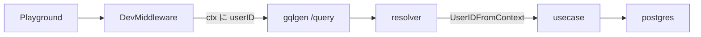
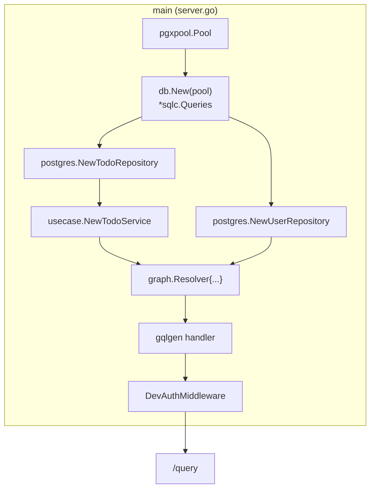

# pathway

### 開発環境

コンテナ立ち上げコマンド
```
docker compose -f compose.yaml -f compose.dev.yaml up -d
```


コンテナ削除コマンド
```
docker compose -f compose.yaml -f compose.dev.yaml down
```

---
## 開発手順

## backend
### schema.graphqlsを更新
#### step1: ドメインを満たすためにtype, query, mutationを更新する
ドメインを満たすためにtype, query, mutationを更新する

#### step2: go generateコマンド実行
```
go generate
```

---
### マイグレーション
#### step1: マイグレーションファイルを作成
```
supabase migration new <name>
```
でマイグレーションファイルを作成する。

#### step2: マイグレーション適用
```
supabase migration up
```
---
### query/*.sqlを更新
Goのコードを自動生成する。

---
### graph/schema.resolvers.goにロジックを記述


### 処理の流れ



### 型変換の流れ
```mermaid
flowchart TB
    subgraph client [Client / Playground]
        JSON["JSON\n{ text: \"hello\" }"]
    end

    subgraph graph [graph 層]
        Input["model.NewTodo\n(input 型)"]
        Out["model.Todo\n(response 型)"]
        Conv["converter.go\nentity → model"]
    end

    subgraph usecase [usecase 層]
        UC["TodoService.CreateTodo\n(userID, text)"]
    end

    subgraph domain [domain 層]
        ET["entity.Todo"]
    end

    subgraph infra [infra/postgres 層]
        DBT["db.Todo"]
        Map["mapper.go\ndb → entity"]
    end

    subgraph db [DB]
        PG[(Postgres)]
    end

    JSON -->|"① gqlgen が自動 deserialize"| Input
    Input -->|"② resolver: input.Text を取り出す"| UC
    UC -->|"③ repository 呼び出し"| ET
    ET -->|"④ interface の戻り値"| UC
    UC --> ET
    ET --> Conv
    Conv --> Out
    Out -->|"⑤ gqlgen が JSON serialize"| JSON

    ET -.->|"repository 内部"| Map
    Map --> DBT
    DBT --> PG
    PG --> DBT
    DBT --> Map
    Map --> ET

```


### server.goの流れ
