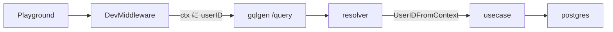

# pathway

### 開発環境

コンテナ立ち上げコマンド
```
docker compose -f compose.yaml -f compose.dev.yaml up -d
```


コンテナ削除コマンド
```
docker compose -f compose.yaml -f compose.dev.yaml down
```

---
## 開発手順

## backend
### schema.graphqlsを更新
#### step1: ドメインを満たすためにtype, query, mutationを更新する
ドメインを満たすためにtype, query, mutationを更新する

#### step2: go generateコマンド実行
```
go generate
```

---
### マイグレーション
#### step1: マイグレーションファイルを作成
```
supabase migration new <name>
```
でマイグレーションファイルを作成する。

#### step2: マイグレーション適用
```
supabase migration up
```
---
### query/*.sqlを更新
Goのコードを自動生成する。

---
### graph/schema.resolvers.goにロジックを記述


### 処理の流れ

