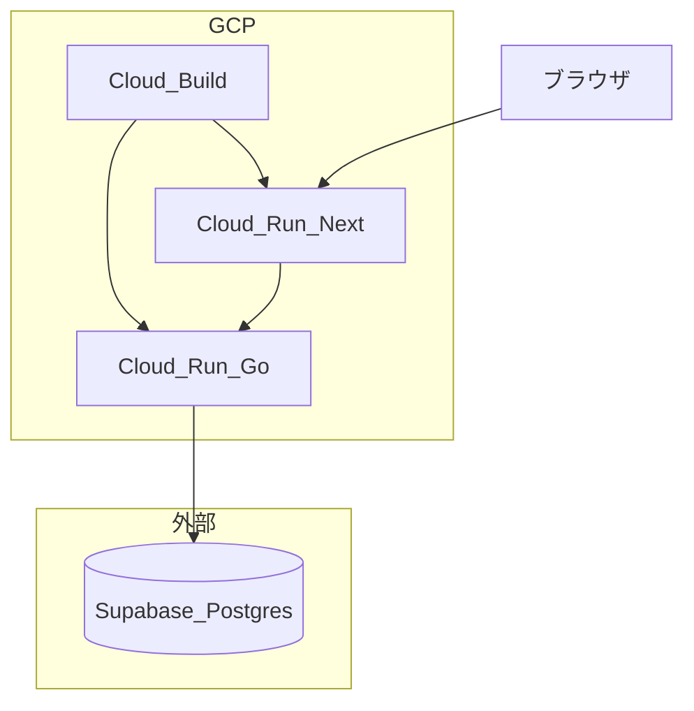

# Pathway ロードマップ

アプリを最速で形にすることを最優先とする。インフラは **まず Cloud Run 上で Go / Next が動くことの確認**、続けて **CD（継続的デプロイ）を自動化**。テスト・Lint などの **CI は Phase ごとに後から足す**。

## 技術スタック（目標）

- **Backend**: Go（GraphQL / gqlgen、sqlc）
- **Frontend**: Next.js, TypeScript
- **Infra**: Cloud Run, Docker, Cloud Build（CD）
- **DB**: PostgreSQL（初期は **Supabase**、必要なら将来 Cloud SQL へ移行）
- **任意**: Redis

## アーキテクチャ概要

---

## Phase 1 — Cloud Run に Go / Next を載せて動作確認

**ゴール**: **Go API** と **Next.js** の両方を **Cloud Run** にデプロイし、ブラウザや `curl` で **期待どおり応答することを確認**する。

- Go: `PORT` 環境変数対応、`/health` 推奨、Next から呼ぶなら **CORS**（本番 Next URL・ローカル `localhost:3000` を環境変数で許可）。
- [backend/Dockerfile](backend/Dockerfile): コンテキスト `backend/` でビルド可能な形。
- `frontend/`: Next.js（TypeScript / App Router）、Hello World 相当で API を表示。
- [frontend/Dockerfile](frontend/Dockerfile): `next build` → `next start`（standalone 推奨）。
- GCP: Artifact Registry にイメージをプッシュし、**Cloud Run サービスを 2 つ**（API / Web）作成。

**この Phase では CD の自動化は必須にしない**（コンソールや `gcloud builds submit` / `gcloud run deploy` など **手動・ワンショットでもよい**）。まず **本番相当環境で動くこと**を優先する。

---

## Phase 2 — CD（継続的デプロイ）の構築

**ゴール**: コードを push（または main マージ）したら **ビルド → Artifact Registry → Cloud Run** までが **再現可能に自動**で回る。

- **設定ファイル**: [cloudbuild.backend.yaml](cloudbuild.backend.yaml)（API: `backend/Dockerfile` → AR → Cloud Run）、[cloudbuild.frontend.yaml](cloudbuild.frontend.yaml)（Web: `frontend/` を `--source` ビルド → Cloud Run）。ルートの [cloudbuild.yaml](cloudbuild.yaml) は API 用のエイリアス（手動 `gcloud builds submit` 用）。
- **Cloud Build トリガ（GCP コンソールで作成）**
  - リポジトリ接続後、**トリガ 2 本**を推奨: ブランチ `^main$`、**含めるパス**は API 用 `backend/**`、Web 用 `frontend/**`。それぞれの「設定ファイルの場所」に上記 YAML を指定。
  - **置換変数**: 実際の Cloud Run サービス名・リポジトリ名が異なる場合、トリガの「置換変数」で `_CLOUD_RUN_API_SERVICE` / `_CLOUD_RUN_WEB_SERVICE` / `_AR_REPOSITORY` / `_API_IMAGE` / `_REGION` を上書きする。
- **Cloud Build 既定 SA**（`...@cloudbuild.gserviceaccount.com`）に、少なくとも **Artifact Registry 書き込み**、**Cloud Run 管理者**、必要に応じて **Cloud Run ランタイム SA への `roles/iam.serviceAccountUser`** を付与。フロントの `--source` ビルドでは **Cloud Storage**（ソース tarball）や **追加の Cloud Build API** 権限が必要になることがあるため、失敗ログに応じてロールを足す。
- **CI（PR での go test / Lint）はまだ必須にしない**（時間をかけすぎない方針）。

---

## Phase 3 — Supabase・マイグレーション・sqlc

**ゴール**: Cloud Run の Go から **Supabase PostgreSQL** に接続し、マイグレーションと sqlc で **スキーマとクエリ層を本番と同じルールで開発**できる状態。

- 接続は **プーラ（Transaction モード等）**を検討（Cloud Run の同時実行 × 接続数）。
- マイグレーションは 1 ツールに統一（goose / golang-migrate / atlas 等）。本番 migrate は **手動**でも **Cloud Build の 1 ステップ**でもよい。
- 将来 Cloud SQL に寄せる場合は **素直な PostgreSQL スキーマ**を保つ。

---

## Phase 4 — GraphQL API（gqlgen）

**ゴール**: `/graphql` でスキーマに沿った読み書き、gqlgen + sqlc。

- **（任意・この頃から）CI 追加**: `go test`、`go vet`、sqlc / gqlgen の生成物が最新か、などを GitHub Actions 等へ。

---

## Phase 5 — ドメイン MVP（必要最低限機能）

- ロードマップ（ツリー）→ 操作・期限・色・アクションは段階導入。
- アクションマップ、Todo（Enter / Tab / 3 状態 / ルーティン）。
- Activity（GitHub 風ヒートマップ、日次スナップショットは Cloud Scheduler 等で検討）。

**（任意）CI**: フロントの Lint / テストを Actions 等へ。

---

## Phase 6 — ポートフォリオ品質・運用

- CI の厚み（ブランチ保護、テスト必須化、ステージング環境など）。
- 観測性（Cloud Logging）、セキュリティ（CORS 本番固定、Secret Manager）。
- README、スクリーンショット、必要なら **Cloud SQL 移行**の検討。

---

## GitHub Actions について

ワークフローはリポジトリ内 YAML のため **いつでも追加・変更できる**。最初は **Cloud Build だけで CD** し、あとから Actions で Lint / テストを足す運用で問題ない。

---

## すぐ着手する順序（Phase 1）

1. `backend/Dockerfile` と [compose.yaml](compose.yaml) 等の整合。
2. `main.go` に `PORT`、CORS、任意で `/health`。
3. Go イメージをビルドし、Cloud Run（API）にデプロイして動作確認。
4. `frontend/` に Next を追加し、API を叩いて Hello 表示までローカル確認。
5. `frontend/Dockerfile` でビルドし、Cloud Run（Web）にデプロイし、本番 URL からの動作確認。

その後 **Phase 2** で同じ手順を Cloud Build トリガに落とし込む。
